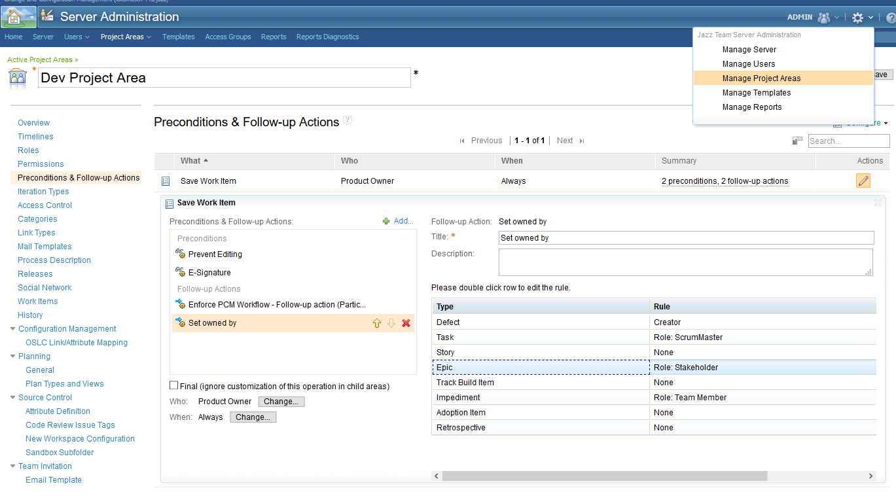

# Set Owned By Participant
A Work Item Save Participant that sets the "Owned By" automatically based on rules.
The rules set a method to be used per Work Item type. Currently there are two:

## Role
Always if "Owned By" is "Unassigned" or if "Filed Against" changed but "Owned By" didn't, the first User with the defined Role
found by recursively searching up the team tree is set. Deciding are the roles assigned at that level, not the cumulative ones.

## Creator
On Tasks it will set the creator as owner if and only if the Work Item is being initialized and the "Owned By" was left as "Unassigned".

## Setup
The most convenient way to install this service is to download the current stable release from the [Releases](../../releases) page.
 If you don't already know how, head over to the [RTC Git Connector](https://github.com/jazz-community/rtc-git-connector) page to learn how to install RTC plug-ins (it's always the same procedure).
 
 ### Configuration
 Best way is to download the [rtc-set-owned-by-participant-editor](https://github.com/jazz-community/rtc-set-owned-by-participant-editor).
 Once that is done click "manage Project Area" -> "Preconditions & Follow-up Actions" -> Edit existing "Save Work Item" configuration or create new one -> "Add..." -> "Set owned by"  
 A list of all Work Item Types of this Project Area and the rules defined for them shows up. To change a Rule just double click the corresponding row and select one from the Pop-Up.
 

## Contributing
Please use the [Issue Tracker](../../issues) of this repository to report issues or suggest enhancements.

For general contribution guidelines, please refer to [CONTRIBUTING.md](https://github.com/jazz-community/welcome/blob/master/CONTRIBUTING.md)

## Licensing
Copyright (c) Siemens AG. All rights reserved. 
Licensed under the [MIT](./LICENSE) License.
