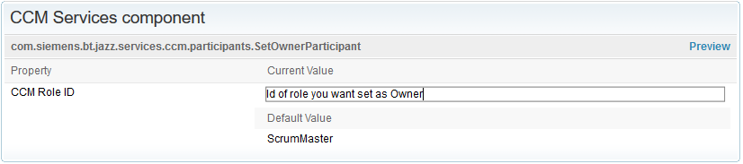

# Set Owned By Participant
A Work Item Save Participant that sets the "Owned By" automatically under certain circumstances.

## Defects
Always if "Owned By" is "Unassigned" or if "Filed Against" changed but "Owned By" didn't, the first User with Role ScrumMaster (see Setup on how to change)
found by recursively searching up the team tree is set. Deciding are the roles assigned at that level, not the cumulative ones.

## Tasks
On Tasks it will set the creator as owner if and only if the Work Item is being initialized and the "Owned By" was left as "Unassigned".

## Setup
The most convenient way to install this service is to download the current stable release from the [Releases](../../releases) page.
 If you don't already know how, head over to the [RTC Git Connector](https://github.com/jazz-community/rtc-git-connector) page to learn how to install RTC plug-ins (it's always the same procedure).
 
 ### Change Role
 Once the plug-in is installed you can go ahead and change the role used for defects under the advanced properties. Just search for "CCM Services component". It has to be the role Id, not the name!
 

## Contributing
Please use the [Issue Tracker](../../issues) of this repository to report issues or suggest enhancements.

For general contribution guidelines, please refer to [CONTRIBUTING.md](https://github.com/jazz-community/welcome/blob/master/CONTRIBUTING.md)

## Licensing
Copyright (c) Siemens AG. All rights reserved. 
Licensed under the [MIT](./LICENSE) License.
